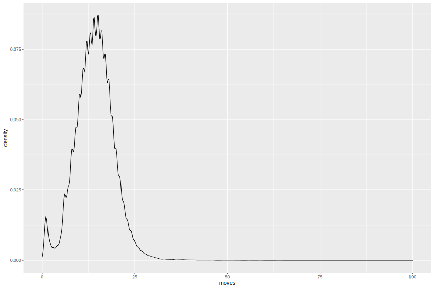

# Distrubtion of game length by chess variant
## Summary
Here, I present the distribution of the length of chess games by chess variant.

Standard chess games and Chess960 games typically terminate before the end of the 32nd move (64th ply). Atomic games are the shortest, often finishing before the end of the 11th move (22nd ply). While Horde games last the longest, generally terminating before the end of the 48th move (96th ply).
### Data collection
Here, I present the distribution of the length of chess games by chess variant.

Standard chess games and Chess960 games typically terminate before the end of the 32nd move (64th ply). Atomic games are the shortest, often finishing before the end of the 11th move (22nd ply). While Horde games last the longest, generally terminating before the end of the 48th move (96th ply). 

I used the length of games played on [Lichess](https://lichess.org/) in August 2022. I sampled games from all available variants up to a limit of 100,000 games for each variant using the data provided by the [Lichess Open Database](database.lichess.org).
### Table

| Variant | Median game length |
| ------- | ------------------ |
| Standard | 32 |
| Atomic | 11 |
| Chess960 | 32 |
| Crazyhouse | 26 |
| Horde | 48 |
| King of The Hill | 23 |
| Racing Kings | 14 |
| Three Check | 15 |

# Kernel density estimates
## All variants

## Standard

## Atomic

## Chess960

## Crazyhouse

## Horde 

## King of The Hill 

## Racing Kings

## Three Check 

## Notes
Games were taken from games played accross all time controls
